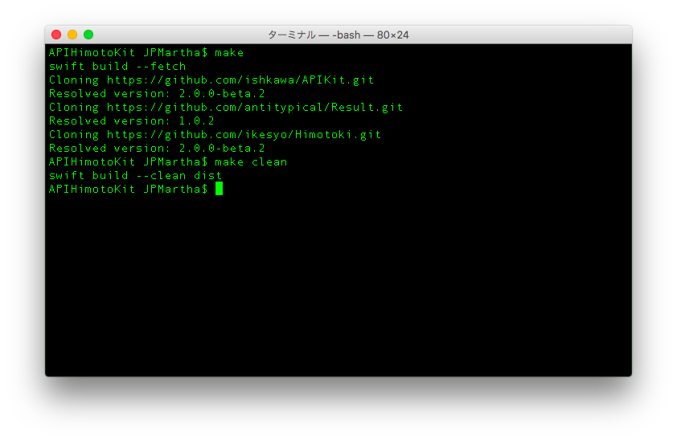

# APIHimotoKit [](https://github.com/apple/swift-package-manager)

__APIHimotoKit__ is an ___unofficial___ tool for trials of the [Swift Package Manager](https://github.com/apple/swift-package-manager/blob/master/README.md).

Currently, it JUST downloads the source code of the [APIKit](https://github.com/ishkawa/APIKit) and the [Himotoki](https://github.com/ikesyo/Himotoki) from GitHub.

The goal is making full use of the Swift Package Manager.💥



## Note

- ⚠️ __APIHimotoKit__ is an ___unofficial___ tool. 
- ⚠️ Please note, the Swift Package Manager is still in early design and development.

## Requirements for Tools

- OS X 10.11 (El Capitan)

## Getting Started

1. The first step to using __APIHimotoKit__ is to download and install the Swift Development Snapshots. Go to the [Download](https://swift.org/download/#snapshots) page and follow the instructions on OS X.

2. You can make the tools available for use from the terminal with the following command:
  
  ```bash
  $ export PATH=/Library/Developer/Toolchains/swift-latest.xctoolchain/usr/bin:"${PATH}"
  ```
  If the following error has occurred,

  ```bash
  dyld: Library not loaded: @rpath/libswiftCore.dylib
  ```
  
  You might be able to fix that from the terminal with the following command:
  
  - https://gist.github.com/norio-nomura/96201467ffd37c077f7c
  
3. Please download from the latest [release](https://github.com/JPMartha/APIHimotoKit/releases) and deploy the `Package.swift` and the `Makefile` at the root directory of your project. 

4. Run the following command:

  ```bash
  $ make
  ```
  
  Then, you can see the downloaded sources in the `Packages/` directory at the root of your project.
    
  For more information about using the Swift Package Manager, see the documentation provided in the [Package Manager project page](https://swift.org/package-manager/) and the [Swift Package Manager project on GitHub](https://github.com/apple/swift-package-manager).
  
  For more information about using the APIKit, see the [ishkawa/APIKit on GitHub](https://github.com/ishkawa/APIKit).
  
  For more information about using the Himotoki, see the [ikesyo/Himotoki on GitHub](https://github.com/ikesyo/Himotoki).
  
## Clean

  You can remove the `Packages/` directory from the terminal with the following command:
  
  ```bash
  $ make clean
  ```

## License

__APIHimotoKit__ is released under the [MIT License](LICENSE.md).

### Swift Package Manager

Copyright 2015 - 2016 Apple Inc. and the Swift project authors. Licensed under Apache License v2.0 with Runtime Library Exception.

See https://swift.org/LICENSE.txt for license information.

See https://swift.org/CONTRIBUTORS.txt for Swift project authors.

### APIKit

Copyright (c) 2015 Yosuke Ishikawa

Permission is hereby granted, free of charge, to any person obtaining a copy of this software and associated documentation files (the "Software"), to deal in the Software without restriction, including without limitation the rights to use, copy, modify, merge, publish, distribute, sublicense, and/or sell copies of the Software, and to permit persons to whom the Software is furnished to do so, subject to the following conditions:

The above copyright notice and this permission notice shall be included in all copies or substantial portions of the Software.

THE SOFTWARE IS PROVIDED "AS IS", WITHOUT WARRANTY OF ANY KIND, EXPRESS OR IMPLIED, INCLUDING BUT NOT LIMITED TO THE WARRANTIES OF MERCHANTABILITY, FITNESS FOR A PARTICULAR PURPOSE AND NONINFRINGEMENT. IN NO EVENT SHALL THE AUTHORS OR COPYRIGHT HOLDERS BE LIABLE FOR ANY CLAIM, DAMAGES OR OTHER LIABILITY, WHETHER IN AN ACTION OF CONTRACT, TORT OR OTHERWISE, ARISING FROM, OUT OF OR IN CONNECTION WITH THE SOFTWARE OR THE USE OR OTHER DEALINGS IN THE SOFTWARE.

### Himotoki

The MIT License (MIT)

Copyright (c) 2015 Syo Ikeda

Permission is hereby granted, free of charge, to any person obtaining a copy of this software and associated documentation files (the "Software"), to deal in the Software without restriction, including without limitation the rights to use, copy, modify, merge, publish, distribute, sublicense, and/or sell copies of the Software, and to permit persons to whom the Software is furnished to do so, subject to the following conditions:

The above copyright notice and this permission notice shall be included in all copies or substantial portions of the Software.

THE SOFTWARE IS PROVIDED "AS IS", WITHOUT WARRANTY OF ANY KIND, EXPRESS OR IMPLIED, INCLUDING BUT NOT LIMITED TO THE WARRANTIES OF MERCHANTABILITY, FITNESS FOR A PARTICULAR PURPOSE AND NONINFRINGEMENT. IN NO EVENT SHALL THE AUTHORS OR COPYRIGHT HOLDERS BE LIABLE FOR ANY CLAIM, DAMAGES OR OTHER LIABILITY, WHETHER IN AN ACTION OF CONTRACT, TORT OR OTHERWISE, ARISING FROM, OUT OF OR IN CONNECTION WITH THE SOFTWARE OR THE USE OR OTHER DEALINGS IN THE SOFTWARE.
